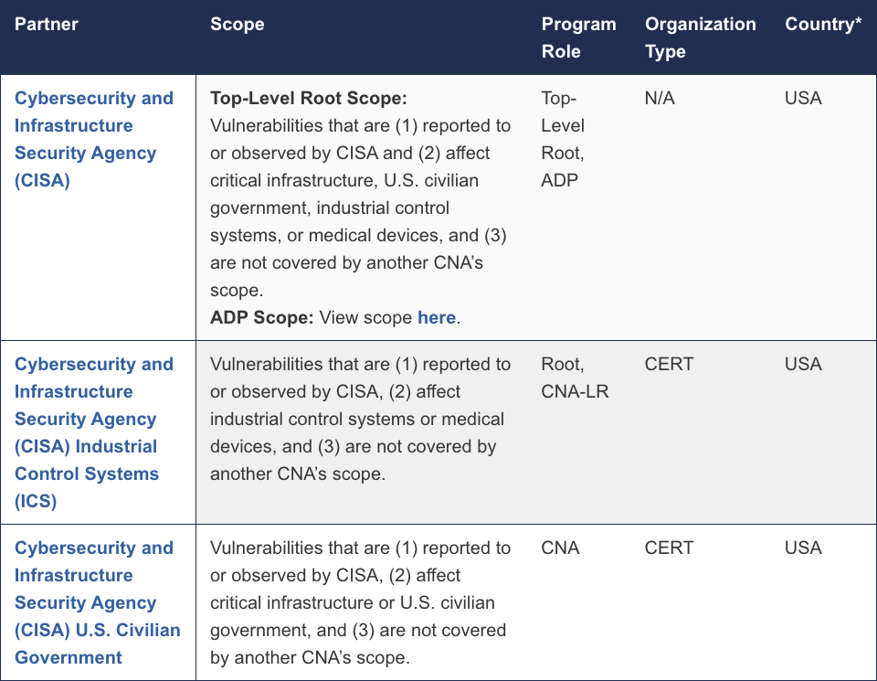

GitHub discussion/issue markdown example, unfortunately this is handled differently by the wiki markdown, and the discussion/issue rendering doesn't handle lists beyond 2 levels?

Jump to [aname](#aname) test.

1. Show me SADP containers
a. For a given SADP
b. For a date (published, updated) range
c. For a given CVE ID
d. For a given CVE ID and SADP
2. Product search would be nice to have, even if it is string matching on elements in the `affected` array

GitHub markdown, 3 space tabs, indenting types are incorrectly ordered [lowercase Roman numerals before alpha](https://github.com/primer/css/blob/86213afafbef0e16c337981a8c3897819f784892/src/base/typography-base.scss#L49-L59).

1.a.i: more common and expected, you alternate numeral and alpha.

1.i.a: possibly a non-US/en/western ordering?

This is probably the easiest option. Don't even need to maintain the ordering manually.

1. Dog
   1. German Shepherd
   1. Belgian Shepherd
      1. Malinois
      1. Groenendael
      1. Tervuren
1. Cat
   1. Siberian
   1. Siamese

While we're testing, here is an image, should be centered.

[MediaWiki](https://www.mediawiki.org/wiki/Help:Lists)

Same "incorrect" style ordering as GitHub markdown.

# Dog
## German Shepherd
## Belgian Shepherd
### Malinois
### Groenendael
### Tervuren
# Cat
## Siberian
## Siamese

[AsciiDoc](https://docs.asciidoctor.org/asciidoc/latest/lists/ordered/)

(#aname)Ignores style sometimes.

[arabic]
. Step 1
. Step 2
[loweralpha]
.. Step 2a
.. Step 2b
[lowerroman]
... smaller
... still
. Step 3
